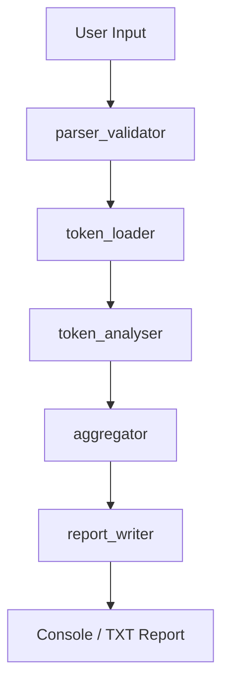
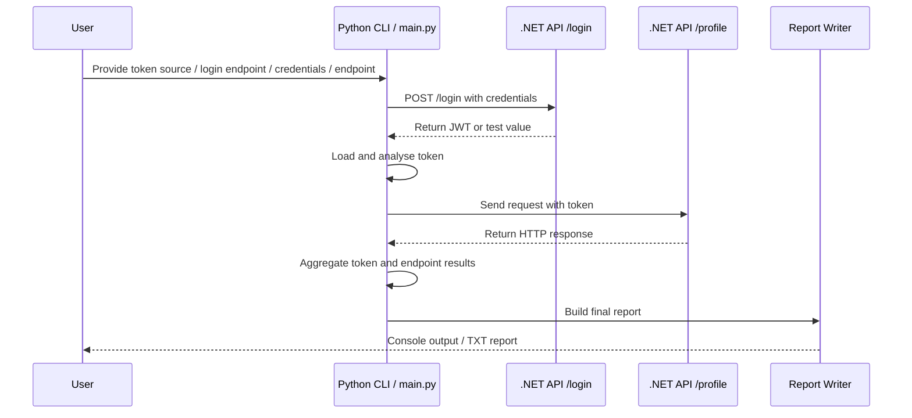
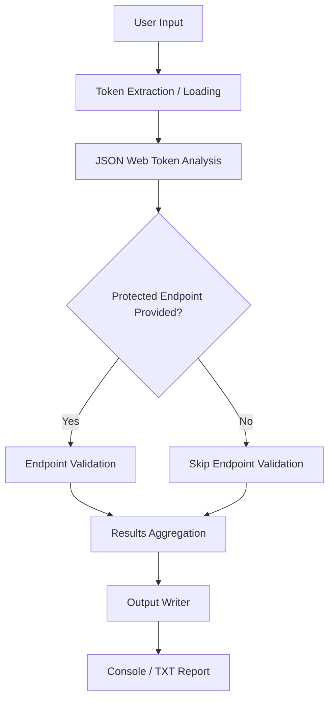
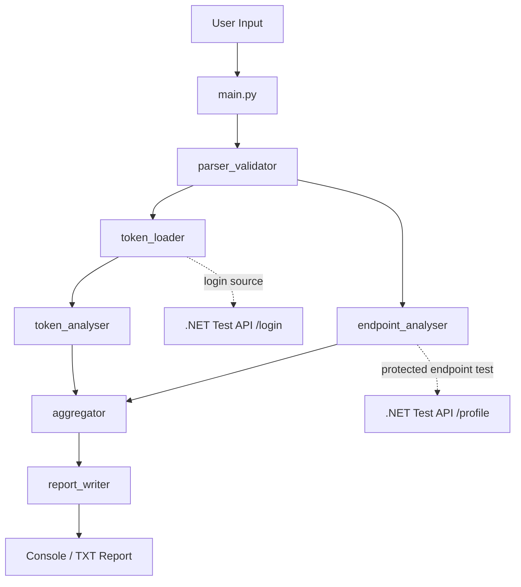

# JWT-Endpoint-Checker
Python CLI tool that validates basic JWT structure and claims, then tests a protected API endpoint using no token, a valid token, and a malformed token. It supports either a supplied JWT or a login flow to obtain one from a local test API, then generates a simple report showing token and endpoint authentication issues.

# Pre-requisites
- Python 3.8 or higher
- .NET 6.0 SDK (for running the test API server)
- Required Python packages (listed in `requirements.txt`)
  * Install dependencies using `pip install -r requirements.txt`
- A configured `appsettings.json` file for the .NET API Server (use `appsettings.template.json` as a starting point)

# Installation

This project has `pyproject.toml` file for managing dependencies and packaging. 
To install the project, run the following command in the terminal:
```pip install -e .```

Thanks to it you can use `checker` command in terminal to run the CLI tool, instead of 
`python <path/main.py> checker -<flag>`.

This project has two main components:
1. A .NET API Server that simulates a protected API endpoint requiring JWT authentication.
2. A Python CLI tool that performs the JWT validation and endpoint testing.

# How to run local test .NET API Server

## .NET API Server appsettings.json
To configure the .NET API Server, you need to set up the `appsettings.json` file with the appropriate settings. 
Please use available in repo `appsettings.template.json` file as a template and update as needed.

To run the test .NET API Server, follow these steps:
1. Open a terminal and navigate to the `checker/src/` directory.
2. Run the following command to start the server: `python checker/src/main.py -s` or if installed `checker -s`.
3. The server will start and listen for incoming requests. You can test the API endpoints using existing Bruno collections.

Note that server will start and create PID.json file in the same directory, which contains the process ID of the running server. 
This file is then used by `python checker/src/main.py -k` or `checker -k` to kill server process.

When the server is running, you can use the CLI tool to test JWT tokens against the protected API endpoint.
Furthermore, the command line window will automatically open for the API server.
No text or data will be printed in the command line window, but it is required to keep it open for the server to run.

# Unit Tests
This project includes unit tests for python code. To run the tests, navigate to the `checker/tests/` directory 
and execute the following command: `pytest -v`

# Mermaid Diagrams

## Simplified Token-Only Flow


## Full Analysis Execution Scenario

## JWT Analysis and Conditional Endpoint Validation Data Flow


## High-level Component Architecture
